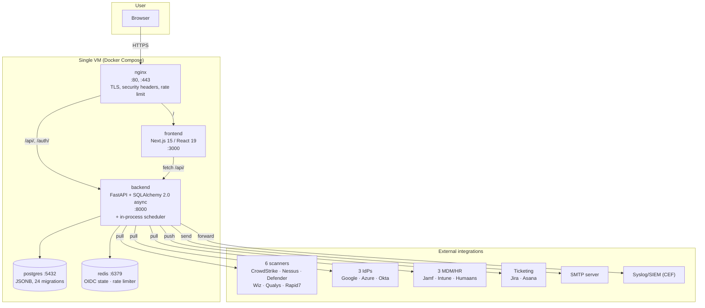
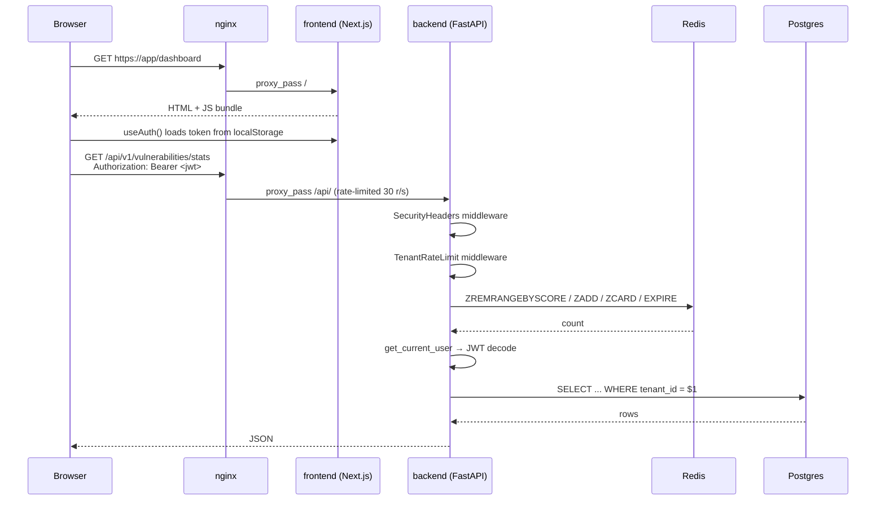
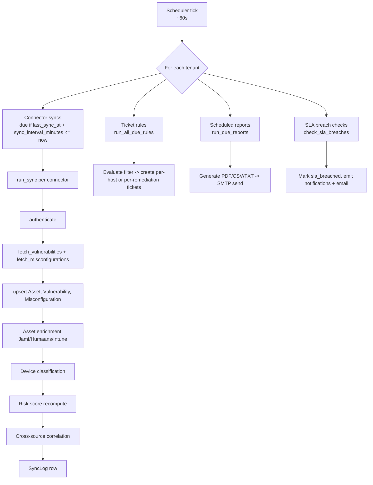
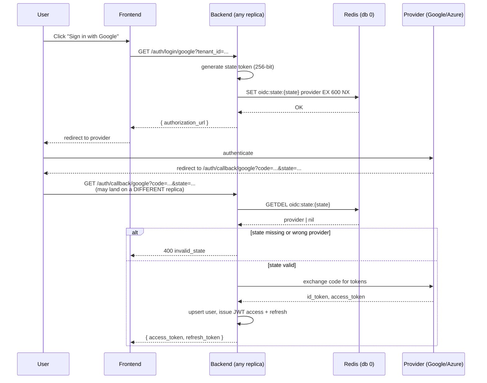
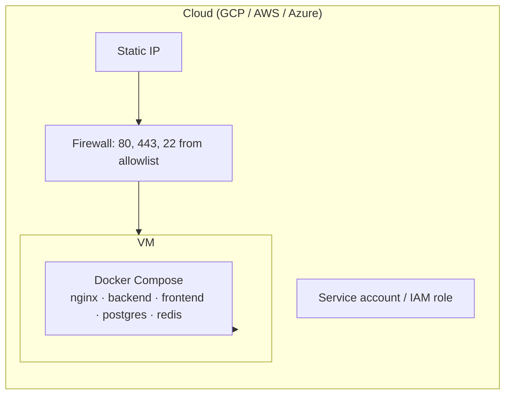

# 02 — Architecture

GetVul is a single-VM, container-based application. Five Docker services sit behind one Nginx reverse proxy. All scanner integrations are pull-based and run in an in-process scheduler inside the FastAPI backend.

## High-level system



Source: [diagrams/architecture-system.mmd](diagrams/architecture-system.mmd).

## Request flow (browser → API)



Middleware order is wired in [backend/app/main.py:179-188](../backend/app/main.py#L179-L188): `CORSMiddleware` → `SecurityHeadersMiddleware` → `TenantRateLimitMiddleware`.

## Connector sync pipeline

The in-process scheduler ([backend/app/connectors/scheduler.py](../backend/app/connectors/scheduler.py)) wakes every ~60s and runs four parallel workstreams.



Source: [diagrams/sync-pipeline.mmd](diagrams/sync-pipeline.mmd).

## Authentication flow (OIDC, post-Phase 1)



The `SET ... NX EX 600` + `GETDEL` pair is what makes the flow safe across replicas: the state can be created by one replica and consumed by another, and replay is blocked because `GETDEL` is atomic. If Redis is unreachable the backend fails closed (HTTP 503) — bypassing state validation would be a CSRF defect (decision D-06 in [.planning/phases/01-multi-replica-state/01-CONTEXT.md](../.planning/phases/01-multi-replica-state/01-CONTEXT.md)).

## Rate-limiter mechanics

`TenantRateLimitMiddleware` ([backend/app/main.py:107-159](../backend/app/main.py#L107-L159)) implements a sliding-window rate limit per tenant using a Redis sorted set:

1. Extract `tenant_id` from JWT (without DB validation; "anonymous" if missing).
2. Build key `ratelimit:{tenant_id}`.
3. In one `MULTI/EXEC` pipeline: `ZREMRANGEBYSCORE` (drop entries older than the window), `ZADD` (insert `{now_ms}:{uuid8}` with score `now_ms`), `ZCARD` (count), `EXPIRE` (set TTL = window).
4. If `ZCARD > 200` → return 429 with `Retry-After`.
5. On `RedisError` → log `redis_unavailable` and **fail open** (limiter is a safety valve, not a security boundary — decision D-05).

The unique uuid suffix on the ZADD member defeats sub-millisecond ZADD coalescing — verified by the 6-test suite in [backend/tests/test_rate_limit.py](../backend/tests/test_rate_limit.py).

## Risk scoring

Per-asset risk score computation ([backend/app/assets/service.py](../backend/app/assets/service.py)):

```
raw = Σ severity_weight × exploit_multiplier × kev_multiplier
        severity_weights:    CRITICAL=40 HIGH=10 MEDIUM=3 LOW=1
        exploit_multiplier:  2.0 if exploit_available else 1.0
        kev_multiplier:      1.5 if cisa_kev else 1.0

score = piecewise_log(raw):
        knee at raw=120, score=45
        below knee → linear
        above knee → log compression to 100
```

Triggered by `POST /api/v1/assets/recompute-risk-scores` (Admin+) and automatically after each connector sync.

## Cross-source correlation

After every vulnerability sync, the correlation pass groups vulns by `(tenant_id, cve_id, asset_id)` and emits a `vulnerability_correlations` row when `COUNT(DISTINCT source) > 1`. Confidence: `HIGH` if ≥3 sources, `MEDIUM` if 2.

## Notification engine

Four scheduled checks per active tenant:

| Check | Lookback | Dedup key |
|-------|----------|-----------|
| New critical vuln | 2h | `(tenant_id, category, cve_id)` |
| SLA breach warning | 24h | `(tenant_id, category, cve_id)` |
| Connector sync failure | 4h | `(tenant_id, category, connector_id)` |
| Risk score spike | 24h | `(tenant_id, category, asset_id)` |

Notifications are stored in `notifications` table (broadcast or per-user) and emailed to OWNER + ADMIN for critical events. Frontend polls `/api/v1/notifications/unread-count` for the bell badge.

## Single-VM deployment topology



Terraform templates exist for all three clouds ([infra/gcp/](../infra/gcp/), [infra/aws/](../infra/aws/), [infra/azure/](../infra/azure/)). GCP is primary; the others validate in CI but are not actively deployed. See [13-deployment.md](13-deployment.md).

## Project structure

For the per-folder walkthrough see [07-project-structure.md](07-project-structure.md). For per-module responsibilities see [08-core-modules.md](08-core-modules.md).
