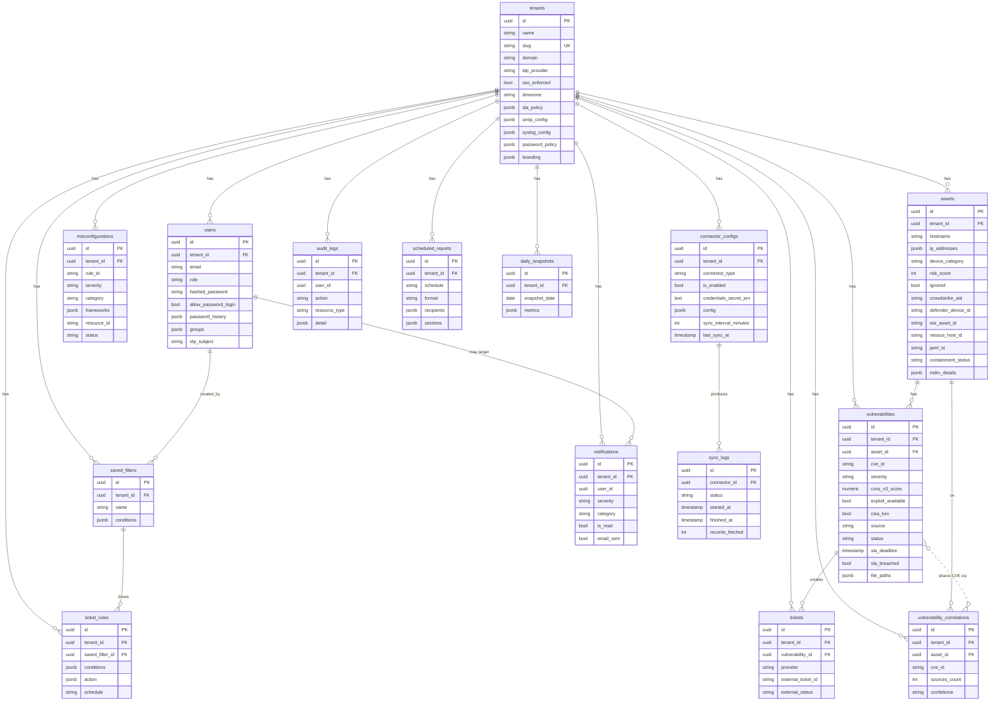

# 09 — Data Model

GetVul uses **PostgreSQL 16** with **SQLAlchemy 2.0 (async)** and **asyncpg**. Schema migrations are managed by **Alembic** (24 versions on disk).

## Entity-relationship overview

Source: [diagrams/data-model-er.mmd](diagrams/data-model-er.mmd).

## Tables

Tables are listed alphabetically within their owning area. All tables include `created_at` and `updated_at` (`server_default=now()`, `onupdate=now()`) via the `TimestampMixin`. Primary keys are `UUID` defaulting to `gen_random_uuid()`.

### Tenancy & users

#### `tenants`
Multi-tenant root. Every other domain row carries `tenant_id`.

| Column | Type | Notes |
|--------|------|-------|
| `id` | UUID PK | `gen_random_uuid()` default |
| `name` | VARCHAR NOT NULL | Display name |
| `slug` | VARCHAR UNIQUE NOT NULL | URL-safe identifier |
| `domain` | VARCHAR | Email domain for OIDC tenant resolution |
| `idp_provider` | VARCHAR | `LOCAL`, `GOOGLE`, `AZURE_ENTRA_ID`, `OKTA` |
| `idp_tenant_id` | VARCHAR | Provider-specific tenant ID (e.g. Azure tenant GUID) |
| `sso_enforced` | BOOLEAN, DEFAULT false | Disables password login (with per-user override) |
| `timezone` | VARCHAR, DEFAULT `UTC` | Tenant timezone |
| `sla_policy` | JSONB | Per-severity SLA deadlines |
| `smtp_config` | JSONB | host, port, user, password (Fernet-encrypted), from_email, use_tls |
| `syslog_config` | JSONB | enabled, host, port, protocol, facility |
| `password_policy` | JSONB | min_length, require_upper/lower/digit/symbol, history_count |
| `branding` | JSONB | logo_url, company_name, tagline, primary_color, accent_color |
| `is_active` | BOOLEAN, DEFAULT true | Soft delete flag |

#### `users`
Application users (one-to-many with `tenants`).

| Column | Type | Notes |
|--------|------|-------|
| `id` | UUID PK | |
| `tenant_id` | UUID FK → `tenants.id` ON DELETE CASCADE | |
| `email` | VARCHAR NOT NULL | Unique within tenant |
| `display_name` | VARCHAR | |
| `avatar_url` | VARCHAR | Often Google profile photo |
| `role` | ENUM NOT NULL | `OWNER`, `ADMIN`, `ANALYST`, `VIEWER` |
| `password_hash` | VARCHAR | bcrypt hash, nullable for SSO-only users |
| `allow_password_login` | BOOLEAN, DEFAULT false | Per-user override of `sso_enforced` |
| `password_history` | JSONB | Previous bcrypt hashes (count from policy) |
| `idp_subject` | VARCHAR | Provider subject claim |
| `idp_source` | VARCHAR | `local`, `google`, `azure`, `okta`, etc. |
| `groups` | JSONB | Synced from IdP — list of group names |
| `is_active` | BOOLEAN, DEFAULT true | |
| `last_login_at` | TIMESTAMPTZ | |

Unique: `(tenant_id, email)`.

### Vulnerability domain

#### `assets`
Devices and cloud resources.

Key columns: `hostname`, `ip_addresses` (JSONB), `os_name`, `os_version`, `device_category` (enum), `risk_score` (int 0-100), `ignored` (bool), scanner-specific IDs (`crowdstrike_aid`, `defender_device_id`, `wiz_asset_id`, `nessus_host_id`, `jamf_id`), `serial_number`, `model`, `assigned_user`, `last_login_user`, `last_seen_at`, `containment_status`, `mdm_details` (JSONB), `seen_by_sources` (JSONB list).

Unique: `(tenant_id, hostname)`.

#### `vulnerabilities`
Normalized findings from any scanner.

Key columns: `cve_id`, `vulnerability_name`, `severity` (enum CRITICAL/HIGH/MEDIUM/LOW/INFO), `cvss_v3_score`, `cvss_v3_vector`, `epss_score`, `exploit_available`, `cisa_kev`, `asset_id` (FK SET NULL), `source` (enum), `source_vuln_id`, `remediation_id`, `remediation_action`, `remediation_info`, `affected_product`, `affected_version`, `fixed_version`, `file_paths` (JSONB), `status` (enum), `sla_deadline`, `sla_breached`, `first_detected_at`, `last_seen_at`, `remediated_at`.

Unique: `(tenant_id, cve_id, asset_id, source)` — this is what makes correlation possible.

> **Drift note** — `VulnSource` enum currently has 4 values (`CROWDSTRIKE`, `NESSUS`, `DEFENDER`, `WIZ`) but Qualys and Rapid7 connectors exist. PROD-04-03 will extend the enum and ship a migration.

#### `vulnerability_correlations`
One row per `(tenant_id, cve_id, asset_id)` confirmed by 2+ sources.

Key columns: `cve_id`, `asset_id` FK, per-source FKs to `vulnerabilities` (one each for CrowdStrike/Nessus/Defender/Wiz), `sources_count`, `confidence` (enum HIGH/MEDIUM).

Unique: `(tenant_id, cve_id, asset_id)`.

### CSPM

#### `misconfigurations`
Cloud findings from Wiz / Defender (and others).

Key columns: `rule_id`, `rule_name`, `category` (enum IAM/NETWORK/ENCRYPTION/LOGGING/STORAGE/COMPUTE/DATABASE/OTHER), `severity`, `frameworks` (JSONB), `resource_id`, `resource_type`, `resource_region`, `cloud_provider`, `cloud_account_id`, `status`, `details` (JSONB).

Unique: `(tenant_id, rule_id, resource_id, source)`.

### Connectors

#### `connector_configs`
One row per (tenant, connector_type).

Key columns: `connector_type` (enum), `is_enabled`, `credentials_secret_arn` (TEXT, Fernet-encrypted JSON), `config` (JSONB), `sync_interval_minutes`, `last_sync_at`, `last_sync_status`, `last_sync_record_count`.

Unique: `(tenant_id, connector_type)`.

#### `sync_logs`
Audit trail for every sync run.

Key columns: `connector_id` FK, `status` (RUNNING/SUCCESS/FAILED/PARTIAL), `started_at`, `finished_at`, `records_fetched`, `records_created`, `records_updated`, `error_message`, `details` (JSONB).

### Ticketing

#### `tickets`
Links a vuln to an external task.

Key columns: `vulnerability_id` FK, `provider` (enum ASANA/JIRA), `external_ticket_id`, `external_ticket_url`, `external_status`, `project_key`, `assignee`, `created_by_user_id`, `created_by_rule`, `detected_at`, `ticket_created_at`, `resolved_at`.

Unique: `(tenant_id, external_ticket_id, provider)`.

#### `ticket_rules`
Automation: filter + schedule → tickets.

Key columns: `name`, `is_enabled`, `saved_filter_id` FK, `conditions` (JSONB), `action` (JSONB — template, assignee, grouping mode), `schedule` (1h/6h/12h/1d/7d), `max_tickets_per_run`, `last_run_at`.

#### `saved_filters`
Reusable filter presets, also referenced by ticket rules.

Key columns: `name`, `conditions` (JSONB — severity, source, exploit, kev, device_category, min_risk_score, …), `created_by` FK → `users`.

### Audit & analytics

#### `audit_logs`
Every mutating user action.

Key columns: `user_id`, `action` (e.g. `auth.login`, `vuln.status_update`), `resource_type`, `resource_id`, `detail` (JSONB), `ip_address`.

#### `scheduled_reports`
Recurring exec PDF/CSV/TXT reports.

Key columns: `name`, `is_enabled`, `schedule` (daily/weekly/monthly), `format` (pdf/csv/txt), `recipients` (JSONB email list), `sections` (JSONB), `filters` (JSONB), `last_sent_at`, `last_send_status`.

#### `daily_snapshots`
Historical metrics for trend charts.

Key columns: `snapshot_date`, `metrics` (JSONB — `total_vulns`, `open_vulns`, `critical_open`, `high_open`, `remediated`, `sla_breached`, `avg_risk_score`, `total_assets`, `open_tickets`, `compliance_pct`).

Unique: `(tenant_id, snapshot_date)`.

#### `notifications`
In-app bell + email.

Key columns: `user_id` (nullable for broadcast), `title`, `message`, `severity` (info/low/medium/high/critical), `category` (`new_critical_vuln`, `sla_breach`, `sync_failure`, `risk_change`), `resource_type`, `resource_id`, `is_read`, `read_at`, `email_sent`, `email_sent_at`, `details` (JSONB).

Indexes: `(tenant_id, user_id, is_read)`, `(tenant_id, category)`, `(tenant_id, created_at)`.

## Migrations

All under [backend/alembic/versions/](../backend/alembic/versions/). Run `make migrate` to apply.

| # | File | What it adds |
|---|------|--------------|
| 001 | `001_initial_schema.py` | Tenants, Users, Assets, Vulnerabilities, ConnectorConfigs, SyncLogs, Tickets, TicketRules |
| 002 | `002_add_misconfigurations.py` | CSPM `misconfigurations` table |
| 003 | `003_widen_credentials_column.py` | `connector_configs.credentials_secret_arn` → TEXT |
| 004 | `004_add_remediation_fields.py` | `remediation_id`, `exploit_status_id`, `cisa_kev` on vulnerabilities |
| 005 | `005_add_device_category_jamf.py` | `device_category` enum + JAMF fields on assets |
| 006 | `006_add_crowdstrike_device_fields.py` | `last_login_user`, `host_status`, `external_ip`, etc. |
| 007 | `007_add_ticket_rule_schedule.py` | `schedule`, `max_tickets_per_run` on `ticket_rules` |
| 008 | `008_add_saved_filters.py` | `saved_filters` table |
| 009 | `009_link_rules_to_filters.py` | `saved_filter_id` FK on `ticket_rules` |
| 010 | `010_add_vuln_file_paths.py` | `file_paths` JSONB on `vulnerabilities` |
| 011 | `011_add_password_auth.py` | `password_hash`, `allow_password_login`, `sso_enforced` |
| 012 | `012_add_user_groups.py` | `groups` JSONB on `users` |
| 013 | `013_add_audit_log.py` | `audit_logs` table |
| 014 | `014_add_syslog_config.py` | `syslog_config` JSONB on `tenants` |
| 015 | `015_add_tenant_timezone.py` | `timezone` on `tenants` |
| 016 | `016_add_password_policy.py` | `password_policy` JSONB on `tenants` |
| 017 | `017_add_scheduled_reports.py` | `scheduled_reports` table |
| 018 | `018_add_smtp_config.py` | `smtp_config` JSONB on `tenants` |
| 019 | `019_add_asset_ignored.py` | `is_ignored`, `ignored_at`, `ignored_reason` on `assets` |
| 020 | `020_add_sla_tracking.py` | `sla_due_at`, `sla_breached` on vulns; `sla_config` on tenants |
| 021 | `021_add_daily_snapshots.py` | `daily_snapshots` table |
| 022 | `022_add_notifications.py` | `notifications` table |
| 023 | `023_add_branding.py` | `branding` JSONB on `tenants` |
| 024 | `024_add_containment_status.py` | `containment_status` on `assets` |

## Caching / denormalization strategy

- **Risk scores** — computed and stored on `assets.risk_score`. Recomputed on demand (`POST /api/v1/assets/recompute-risk-scores`) and after each sync.
- **Daily snapshots** — pre-aggregated metrics in `daily_snapshots` so trend charts don't re-aggregate on every page load.
- **`assets.seen_by_sources`** — denormalized JSONB list of scanner names that have ever seen this asset, kept for fast filter UI.
- **`vulnerability_correlations`** — pre-computed denorm of cross-source matches; refreshed after each vuln sync.
- **No Redis caching of query results.** Redis holds OIDC state and rate-limiter sorted sets only. Adding response caching is a Phase 7 conversation.
