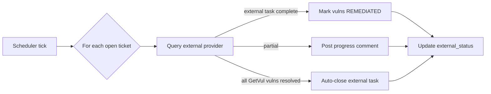

# 11 — Integrations

This document covers every third-party system GetVul talks to: vulnerability scanners, ticketing systems, identity providers, and HR/MDM systems. For the data they populate, see [09-data-model.md](09-data-model.md). For request flow, see [02-architecture.md](02-architecture.md).

## Overview

GetVul supports 14 connector types across 4 categories:

| Category | Connectors | Count |
|----------|-----------|-------|
| **Vulnerability Scanners** | CrowdStrike Falcon Spotlight, Tenable Nessus, Microsoft Defender for Endpoint, Wiz, Qualys VMDR, Rapid7 InsightVM | 6 |
| **Ticketing** | Asana, Jira | 2 |
| **Identity Providers** | Google Workspace, Azure Entra ID, Okta | 3 |
| **Enrichment and MDM** | Humaans, Jamf Pro, Microsoft Intune | 3 |

---

## Vulnerability Scanners

### CrowdStrike Falcon Spotlight
- **Data:** Spotlight vulnerabilities, device info, file paths, exploit status, CISA KEV, CSPM
- **Auth:** OAuth 2.0 (client_id + client_secret)
- **Base URL:** Configurable (us-1, us-2, eu-1)
- **Sync strategy:** Per-severity queries (CRITICAL then HIGH then MEDIUM then LOW), batch device/remediation/evaluation logic resolution
- **Fields synced:** CVE, severity, CVSS, product, version, remediation, file paths, exploit status, CISA KEV, host details (serial, model, login user, host status, platform)
- **Enrichment:** Serial number, last login user, host status, model info, containment status merged into asset records

### Tenable Nessus
- **Data:** Vulnerability scan results
- **Auth:** API keys (access_key + secret_key)
- **Fields synced:** CVE, severity, CVSS, plugin details, affected hosts

### Microsoft Defender for Endpoint
- **Data:** Machine vulnerabilities, device inventory
- **Auth:** Client credentials (Azure app registration)
- **Permissions:** Machine.Read.All, Vulnerability.Read.All (Application)
- **Fields synced:** CVE, severity, machine info, remediation recommendations

### Wiz
- **Data:** Cloud vulnerabilities, CSPM findings
- **Auth:** Client credentials (service account)
- **Fields synced:** CVE, severity, cloud resource details, misconfiguration findings

### Qualys VMDR
- **Data:** Vulnerability scan results, asset inventory
- **Auth:** Username + password (API credentials)
- **Fields synced:** QID, CVE mapping, severity, affected hosts, remediation

### Rapid7 InsightVM
- **Data:** Vulnerability scan results, asset data
- **Auth:** API key
- **Fields synced:** CVE, severity, CVSS, risk score, affected assets, remediation steps

---

## Ticketing

### Asana
- **Data:** Create/update/close/delete tasks, add comments
- **Auth:** Personal Access Token
- **Config:** Workspace + Project selection via Settings UI
- **Features:** Per-host tickets, per-remediation tickets, auto-assignment, SLA due dates, daily status sync, progress comments, auto-close on resolution

### Jira
- **Data:** Create/update/close/comment on issues
- **Auth:** API token (email + token)
- **Config:** Site URL, project key, issue type
- **Features:** Per-host tickets, per-remediation tickets, status sync, bulk actions

---

## Identity Providers

### Google Workspace
- **Data:** Directory users (name, email, department, job title, avatar) + groups with memberships
- **Auth:** Service Account JSON key file (paste full JSON content) + admin email for domain-wide delegation impersonation
- **Setup:** Upload the service account JSON key file content directly into the connector configuration; no manual token management required
- **Scopes:** admin.directory.user.readonly, admin.directory.group.readonly, admin.directory.group.member.readonly
- **SSO:** Provides OIDC authentication for user login
- **Avatar sync:** Fetches Google profile photos for display in the Users dashboard

### Azure Entra ID
- **Data:** Directory users + groups via Microsoft Graph API
- **Auth:** Client credentials (app registration: client_id, client_secret, tenant_id)
- **Permissions:** User.Read.All, Group.Read.All, GroupMember.Read.All (Application)
- **SSO:** Provides OIDC authentication for user login

### Okta
- **Data:** Directory users + groups
- **Auth:** API token
- **Fields synced:** Users, group memberships, profile attributes

---

## Enrichment and MDM

### Humaans
- **Data:** HR data -- name, email, GitHub, LinkedIn, Element handles, teams, location, timezone
- **Auth:** Bearer token (API Access Token)
- **Matching:** Email local part matched to scanner last_login_user, preferred/first name matched to hostname patterns
- **Custom fields:** Auto-detects "GitHub" (top-level + custom), "Element"/"Matrix" custom fields

### Jamf Pro
- **Data:** Apple device MDM -- FileVault, SIP, Gatekeeper, model, serial, assigned user
- **Auth:** OAuth 2.0 (client_id + client_secret)
- **Base URL:** Auto-strips trailing `/api` to prevent double-path issues
- **Matching:** Serial number matched to scanner asset, login username matched to last_login_user, hostname fallback
- **Fields synced:** FileVault status, SIP status, Gatekeeper status, department, building, model, serial

### Microsoft Intune
- **Data:** Device compliance, management state, enrollment info
- **Auth:** Client credentials (Azure app registration)
- **Permissions:** DeviceManagementManagedDevices.Read.All (Application)
- **Fields synced:** Compliance state, OS version, management agent, enrollment date

---

## Connector Management

### API Endpoints
| Endpoint | Description |
|----------|-------------|
| `GET /api/v1/connectors/types` | Metadata for all 14 connector types |
| `GET /api/v1/connectors` | List configured connectors |
| `POST /api/v1/connectors` | Create connector |
| `PATCH /api/v1/connectors/{id}` | Update credentials/config |
| `DELETE /api/v1/connectors/{id}` | Delete connector |
| `POST /api/v1/connectors/test` | Test credentials |
| `POST /api/v1/connectors/{id}/sync` | Trigger sync |
| `GET /api/v1/connectors/{id}/sync-status` | Check sync status |

### Credential Storage
- Encrypted with Fernet symmetric encryption before database storage
- Decrypted only in memory during active sync
- Never exposed in API responses
- One connector per type per tenant (unique constraint)

### Background Scheduler
- Checks all enabled connectors every 60 seconds
- Triggers sync based on `sync_interval_minutes` per connector
- Prevents concurrent syncs per connector
- Logs all results to `sync_logs` table with detailed metrics
- Enrichment and classification passes run after vulnerability sync

### Sync Status Values
| Status | Description |
|--------|-------------|
| RUNNING | Sync currently in progress |
| SUCCESS | Sync completed without errors |
| FAILED | Sync failed (error_message populated) |
| PARTIAL | Sync completed with some errors |

---

## Ticketing in depth (Asana + Jira)

### Ticket types

**Per-host tickets** — One task per affected host listing all its remediations.
- Title: `[CRITICAL] Remediate server-01 — 9 vulns (1 critical)`
- Body: host details + numbered remediation actions with CVE IDs, file paths, exploit/KEV flags
- Assignee: HR-linked user email from Humaans match
- Due date: highest-severity SLA

**Per-remediation tickets** — One task per remediation action listing all affected hosts.
- Title: `[CRITICAL] Update OpenSSL to 3.1.5 — 2 hosts`
- Body: remediation action + affected hosts with per-host CVE breakdown
- Assignee: configurable (fixed user)

### Automation rules

Automatically create tickets on a schedule for hosts matching saved-filter conditions.

| Setting | Options |
|---------|---------|
| Saved filter | Required reference to a saved vulnerability/remediation filter |
| Schedule | 1h, 6h, 12h, 1 day, 7 days |
| Max tickets per run | 5, 10, 25, 50, 100 |
| Grouping | per-host or per-remediation |
| Assignee | auto (HR-linked) or fixed user |

The scheduler ticks every ~60s and triggers rules whose `last_run_at + schedule <= now`. Dedup: rules skip hosts/remediations that already have an open ticket.

### Daily ticket-status sync

### Ticket lifecycle states

`CREATE` (manual or rule-driven) → `TRACK` (visible in `/dashboard/tickets`) → `SYNC` (daily check) → `PROGRESS` (partial remediation comment) → `AUTO-CLOSE` (when all related vulns are resolved) → `CLOSE` (manual override) → `DELETE` (removes from both systems, reopens IN_PROGRESS vulns to OPEN).

### SLA-based due dates

| Severity | Default SLA |
|----------|-------------|
| CRITICAL | 3 days |
| HIGH | 14 days |
| MEDIUM | 30 days |
| LOW | 90 days |

Configurable per tenant in `Settings → SLA Policy`.

### Bulk actions

Multi-select tickets in the UI for: **Close**, **Comment**, **Sync Update**, **Delete**.

### Ticketing API endpoints

See [10-api-reference.md](10-api-reference.md#tickets-apiv1tickets) — `/api/v1/tickets/*` (17 endpoints, including `/rules/*` for automation rule CRUD).

---

## Outbound integrations not covered above

| Integration | Direction | Where in code | Purpose |
|-------------|-----------|---------------|---------|
| SMTP | outbound | [backend/app/email.py](../backend/app/email.py) | Password reset emails, scheduled report delivery, alert digests. Per-tenant config in `tenants.smtp_config`. |
| Syslog (CEF) | outbound | [backend/app/audit.py](../backend/app/audit.py) | Audit log forwarding to SIEMs. Per-tenant config in `tenants.syslog_config`. |

## Inbound integrations

GetVul does **not** receive webhooks today. All integrations are pull-based via the in-process scheduler. Adding inbound webhooks would require deciding whether to use Redis pub/sub or a dedicated worker — currently out of scope.

## Where to set credentials

All connector credentials are configured through the UI at `/dashboard/connectors`. Click the connector card → "Edit" → paste credentials. They are encrypted with Fernet ([backend/app/encryption.py](../backend/app/encryption.py)) before being stored in `connector_configs.credentials_secret_arn`.

You **never** put scanner credentials in `.env`. The only exceptions are `GOOGLE_CLIENT_ID` / `GOOGLE_CLIENT_SECRET` and `AZURE_CLIENT_ID` / `AZURE_CLIENT_SECRET` for the SSO login flow itself — those go in `.env`. See [05-configuration.md](05-configuration.md).

## Provider docs

| Provider | Docs |
|----------|------|
| CrowdStrike Falcon Spotlight | https://falcon.crowdstrike.com/documentation/ |
| Tenable Nessus | https://docs.tenable.com/nessus/ |
| Microsoft Defender for Endpoint | https://learn.microsoft.com/en-us/microsoft-365/security/defender-endpoint/ |
| Wiz | https://docs.wiz.io/ |
| Qualys VMDR | https://docs.qualys.com/en/vm/ |
| Rapid7 InsightVM | https://docs.rapid7.com/insightvm/ |
| Asana | https://developers.asana.com/ |
| Jira (Cloud) | https://developer.atlassian.com/cloud/jira/platform/ |
| Google Workspace | https://developers.google.com/workspace/admin/directory |
| Microsoft Graph (Azure / Intune) | https://learn.microsoft.com/en-us/graph/ |
| Okta | https://developer.okta.com/docs/ |
| Humaans | https://docs.humaans.io/ |
| Jamf Pro | https://developer.jamf.com/ |
