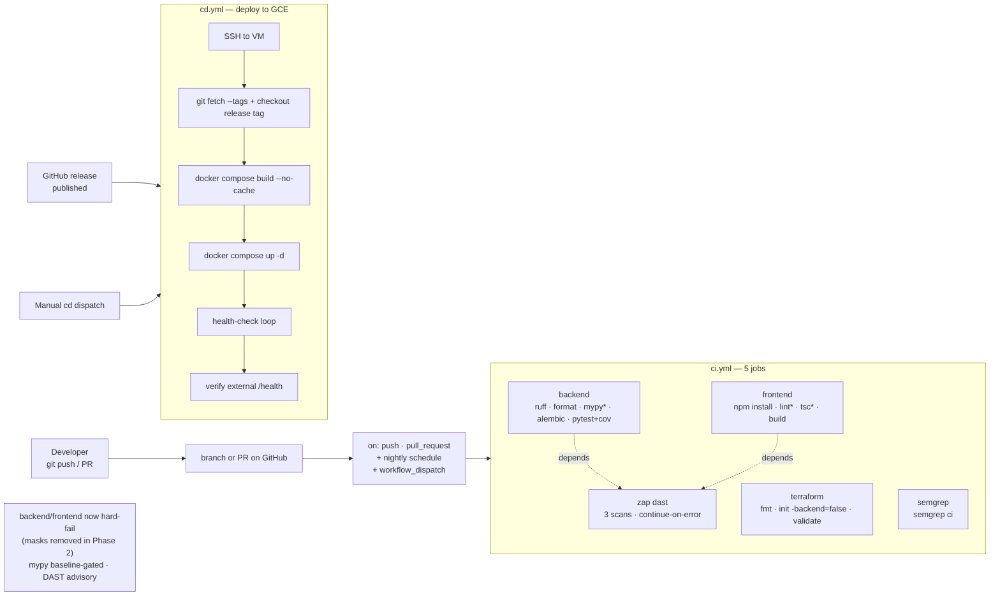

# 12 — Pipelines / CI / CD

GetVul uses **GitHub Actions** for both CI and CD. Two workflow files live in [.github/workflows/](../.github/workflows/): `ci.yml` and `cd.yml`. There is no GitLab CI, CircleCI, or Jenkins config in the repo.

## Pipeline at a glance



Source: [diagrams/pipelines-cicd.mmd](diagrams/pipelines-cicd.mmd).

---

## CI — `ci.yml`

Full file: [.github/workflows/ci.yml](../.github/workflows/ci.yml).

### Triggers

```yaml
on:
  workflow_dispatch:  # Manual trigger
  push:
    branches: [main]
  pull_request:
    branches: [main]
  schedule:
    - cron: '0 3 * * *'   # 03:00 UTC nightly DAST sweep
```

CI runs on every push to `main`, every pull request targeting `main`, a nightly `schedule` (03:00 UTC DAST sweep), and on-demand via `workflow_dispatch`. The required checks gate merges into `main` — see branch protection in [13-deployment.md](13-deployment.md#ci-gating--branch-protection).

### Job: `backend`

Runs on Ubuntu latest, Python 3.12, with sidecar Postgres 16 + Redis 7 services.

| Step | What it runs | Soft-fail? |
|------|--------------|------------|
| Checkout | `actions/checkout@v5` | — |
| Setup Python | `actions/setup-python@v6` (3.12) | — |
| Install deps | `pip install -e ".[dev]"` | — |
| Lint | `ruff check .` | hard-fail |
| Format check | `ruff format --check .` | hard-fail |
| Type check | `set +o pipefail; mypy app/ \| mypy-baseline filter --allow-unsynced` | hard-fail on **new** errors ([line 69](../.github/workflows/ci.yml#L69)) |
| Migrate | `alembic upgrade head` against `getvul_test` DB | hard-fail |
| Test | `pytest -v --cov=app --cov-report=xml` (env: `JWT_SECRET_KEY=test-secret`, `ENVIRONMENT=test`) | hard-fail |
| Coverage upload | `codecov/codecov-action@v5` (only on PRs) | — |

### Job: `frontend`

| Step | What it runs | Soft-fail? |
|------|--------------|------------|
| Checkout | `actions/checkout@v5` | — |
| Setup Node | `actions/setup-node@v5` (20, with `cache: npm`) | — |
| Install | `npm install --legacy-peer-deps` | — |
| Lint | `npm run lint` | hard-fail ([line 107](../.github/workflows/ci.yml#L107)) |
| Type check | `npx tsc --noEmit` | hard-fail ([line 109](../.github/workflows/ci.yml#L109)) |
| Build | `npm run build` (`NEXT_PUBLIC_API_URL=http://localhost:8000`) | hard-fail |

### Job: `terraform`

| Step | What it runs |
|------|--------------|
| Setup | `hashicorp/setup-terraform@v4` (1.7) |
| Format check | `terraform fmt -check -recursive` |
| Init | `terraform init -backend=false` |
| Validate | `terraform validate` |

Hard-fails on any issue. This validates AWS, GCP, and Azure modules even though only GCP is the active target.

### Job: `semgrep`

Runs in `semgrep/semgrep` container. One step:

```yaml
- run: semgrep ci
  env:
    SEMGREP_APP_TOKEN: ${{ secrets.SEMGREP_APP_TOKEN }}
```

If the token is set, results are published to semgrep.dev for tracking.

### Job: `dast`

`needs: [backend, frontend]`, and gated with `if: github.event_name != 'pull_request'` so it does **not** run on PRs — it runs post-merge (push→`main`) and on the nightly schedule. Spins up the slim CI compose ([docker-compose.ci.yml](../docker-compose.ci.yml)), polls `/health` until ready, then runs three ZAP scans.

| Step | Target | Soft-fail? |
|------|--------|------------|
| ZAP API Scan | `http://localhost:8000/openapi.json` | ⚠ `continue-on-error: true` ([line 177](../.github/workflows/ci.yml#L177)) |
| ZAP Baseline (backend) | `http://localhost:8000` | ⚠ `continue-on-error: true` ([line 186](../.github/workflows/ci.yml#L186)) |
| ZAP Baseline (frontend) | `http://localhost:3000` | ⚠ `continue-on-error: true` ([line 195](../.github/workflows/ci.yml#L195)) |
| Cleanup | `docker compose -f docker-compose.ci.yml down -v` | always runs (`if: always()`) |

Each ZAP step uploads its report as a CI artifact (e.g. `zap-api-scan`).

### Gating status (PROD-02 — complete)

The soft-fail masks are gone; the gate is enforced. Delivered in Phase 2 (see [13-deployment.md](13-deployment.md#ci-gating--branch-protection)):

- PROD-02-01 — push + pull_request triggers re-enabled (plus a nightly `schedule` and manual `workflow_dispatch`)
- PROD-02-02 — the three `mypy`/`lint`/`tsc` `|| true` masks removed; mypy now runs through a committed baseline (`set +o pipefail; mypy app/ | mypy-baseline filter --allow-unsynced`), hard-failing only on **new** type errors
- PROD-02-03 — ZAP DAST kept advisory (`continue-on-error`) and gated off PRs (`if: github.event_name != 'pull_request'`); it runs post-merge and nightly, and is **not** a required check
- PROD-02-04 — `main` branch protection requires the four checks (Backend, Frontend, Semgrep SAST, Terraform Validate) green + a PR before merge; empirically proven a failing check blocks the merge

---

## CD — `cd.yml`

Full file: [.github/workflows/cd.yml](../.github/workflows/cd.yml).

### Triggers

```yaml
on:
  release:
    types: [published]
  workflow_dispatch:
    inputs:
      release_tag:
        description: "Release tag to deploy (e.g. v1.0.0) — for manual deploys and rollbacks"
        type: string
        required: false
```

So CD runs on **GitHub release publish** or a manual **`workflow_dispatch`** run.

### Job: `deploy`

Single job, `runs-on: ubuntu-latest`.

1. **Resolve deploy tag** — a step resolves `DEPLOY_TAG` from `github.event.release.tag_name || inputs.release_tag`. Exits 1 if no tag is resolved (fail-fast guard).
2. **Configure SSH** — drops `secrets.GCE_SSH_PRIVATE_KEY` into `~/.ssh/deploy_key`, runs `ssh-keyscan -H $GCE_VM_IP` to populate `known_hosts`.
3. **Deploy to VM** — opens an SSH session as `deploy@$GCE_VM_IP` and runs:
   A 'Resolve deploy tag' step first sets `DEPLOY_TAG` from `github.event.release.tag_name || inputs.release_tag`.
   ```bash
   cd /opt/getvul
   git fetch --tags --force
   git checkout --force "$DEPLOY_TAG"   # detached HEAD — the released tag
   docker compose build --no-cache
   docker compose up -d
   for i in $(seq 1 30); do
     if curl -sf http://localhost:8000/health; then break; fi
     sleep 5
   done
   curl -sf http://localhost:8000/health || exit 1
   docker image prune -f
   ```
4. **Verify deployment** — back on the runner, curls `http://$GCE_VM_IP/health` and checks the body for `"status":"ok"`. Exits 1 if not.

### Required secrets

| Secret | Purpose |
|--------|---------|
| `GCE_VM_IP` | Public IP of the production VM (used in `ssh -i ~/.ssh/deploy_key deploy@$VM_IP`) |
| `GCE_SSH_PRIVATE_KEY` | SSH private key authorized in the VM's `~/.ssh/authorized_keys` |
| `SEMGREP_APP_TOKEN` (CI only) | Optional — enables result publishing |

### PROD-03 — resolved

The competing auto-update cron was removed and CD now deploys the released tag (not main HEAD). Rollback is documented in [13-deployment.md](13-deployment.md#rollback).

---

## Pre-commit hooks and local gates

| Tool | Configured? | Notes |
|------|-------------|-------|
| `.pre-commit-config.yaml` | ✗ none | Adding one is recommended (see [06-development-workflow.md](06-development-workflow.md)) |
| Husky / lint-staged | ✗ none | Frontend has no commit-time hooks |
| `.gitleaks.toml` | ✓ exists | Allowlist for dev keys; not invoked by any local hook |

`make lint`, `make fmt`, `make typecheck`, `make test` are the local equivalents of CI checks.

## Artefacts

| Artefact | Where it goes |
|----------|---------------|
| ZAP reports | CI artifacts: `zap-api-scan`, `zap-backend-baseline`, `zap-frontend-baseline` (default 90-day retention) |
| Coverage XML | uploaded to codecov.io on PRs |
| Build images | Built but **not pushed** to a registry — the CD path rebuilds on the VM with `docker compose build --no-cache` rather than pulling pre-built images. Phase 3 may revisit this. |

## What's missing

- No image build + push to GHCR / GCR / ECR. Cloud builds use the host's local Docker daemon.
- No staging environment. CD goes straight to production.
- No canary or blue/green deploys. The `docker compose up -d` rolls forward in place.
- No deploy notifications (Slack, email).

These are deliberate scope choices for the single-VM model and would be revisited if a multi-replica or multi-region deployment becomes a priority.
