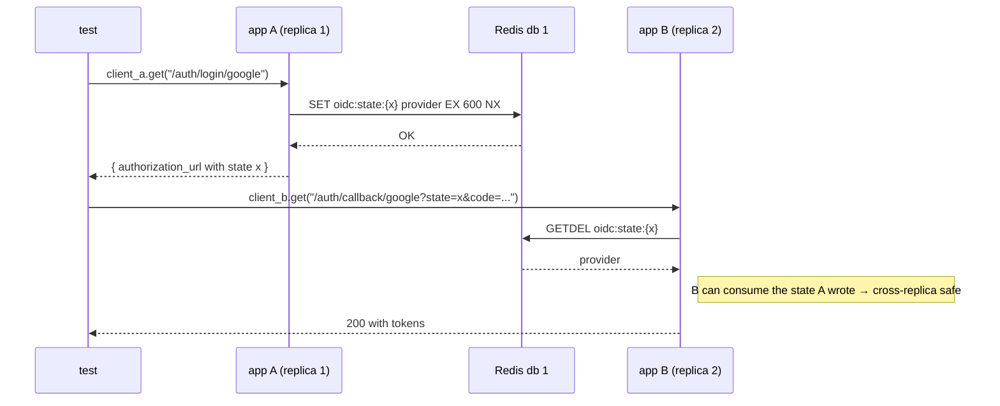

# 14 — Testing

The current test landscape is **backend-only**. Frontend tests are tracked under PROD-08 (Phase 8: Test Coverage Floor) and not yet shipped.

## What exists today

```
backend/tests/
├── conftest.py              94 lines   shared async fixtures (Phase 1)
├── test_auth.py            119 lines   email/password + OIDC mock + JWT
├── test_oidc_state.py       95 lines   Phase 1 — Redis SET NX EX 600 + GETDEL
├── test_rate_limit.py      255 lines   Phase 1 — sorted-set sliding window, fail-OPEN
├── test_multi_replica.py   159 lines   Phase 1 — two FastAPI replicas + shared Redis
├── test_tenant_isolation.py 158 lines  data-leakage prevention
├── test_vulnerabilities.py  70 lines   list/stats endpoints
└── test_connectors/                    directory exists, currently empty (PROD-08-01)
```

Total: **7 files, 950 LOC**. No frontend tests.

## Frameworks

| Tool | Version | What it covers |
|------|---------|----------------|
| pytest | `>=8.3` | Test runner |
| pytest-asyncio | `>=0.24` | `asyncio_mode = "auto"` (every `async def test_*` is awaited) |
| pytest-cov | `>=6.0` | Coverage XML upload to codecov in CI |
| asgi-lifespan | `>=2.1` | `LifespanManager` — runs FastAPI lifespan in tests so `app.state.redis` is populated |
| httpx | `>=0.27` | `AsyncClient(transport=ASGITransport(app))` to call the in-memory app |
| factory-boy | `>=3.3` | Test data factories (limited use today) |

Configuration: [`backend/pyproject.toml`](../backend/pyproject.toml) `[tool.pytest.ini_options]`:

```toml
asyncio_mode = "auto"
testpaths = ["tests"]
```

Lint exemption for tests: `[tool.ruff.lint.per-file-ignores]` allows `F841` (unused locals) under `tests/**`.

## Running tests

```bash
make test         # in container, with coverage
# or
make test-local   # host-side (run `pip install -e ".[dev]"` in backend/ first)
```

Both expand to:

```bash
pytest -v --cov=app --cov-report=term-missing
```

To run a subset:

```bash
make backend-shell
pytest -v tests/test_oidc_state.py                  # one file
pytest -v tests/test_rate_limit.py::test_window_sl  # one test
pytest -v -k 'multi_replica'                        # name match
pytest -v -m 'not slow'                             # mark filter
```

## Test infrastructure (Phase 1)

The fixtures in [`backend/tests/conftest.py`](../backend/tests/conftest.py) are the foundation for everything multi-replica.

### `redis_test_url` (autouse)

Monkeypatches `REDIS_URL=redis://localhost:6379/1` and reloads `Settings`. Forces tests onto **Redis db 1** so they never collide with the app's db 0.

### `flushed_redis`

Yields a `redis.asyncio.Redis` client on db 1, with `FLUSHDB` before and after each test. Asserts `db == 1` (Pitfall 4 safeguard from the Phase 1 RESEARCH doc — refuses to flush prod db 0).

### `app_factory`

Returns a callable `() -> FastAPI` that builds a fresh app via `create_app()`. Each call yields an independent app.

### `single_app`

Yields `(client, app)` where:

- `client` is an `httpx.AsyncClient(transport=ASGITransport(...))` wired through `LifespanManager(app)` so lifespan startup/shutdown actually run
- `app` is the **original FastAPI instance** (not LifespanManager's wrapped closure) so tests can read `app.state.redis` directly

This contract was tightened in Plan 01-01 — the LifespanManager wrapper hides `.state` access; tests need the real instance.

### `two_apps`

Yields `(client_a, app_a, client_b, app_b)` — two independent FastAPI instances, each with its own lifespan and HTTP client, both pointed at the same Redis db 1. This is what proves cross-replica state sharing in [`test_multi_replica.py`](../backend/tests/test_multi_replica.py).



## Test categories

| File | Type | Notes |
|------|------|-------|
| `test_auth.py` | unit + integration | Mocks the OIDC provider's token-exchange HTTP call; otherwise hits the real DB and Redis |
| `test_oidc_state.py` | integration | Real Redis, validates SET-NX-EX semantics, GETDEL atomicity, replay rejection, provider-mismatch state burning |
| `test_rate_limit.py` | integration | Validates sorted-set sliding window, uuid-suffix dedup defeat, fail-OPEN on `RedisError`, per-tenant isolation, doc parity |
| `test_multi_replica.py` | end-to-end | Two-app fixture; proves cross-replica state |
| `test_tenant_isolation.py` | integration | Data-leakage tests across multiple tenants |
| `test_vulnerabilities.py` | integration | List/stats happy-path |

All tests hit a **real Redis instance** and a **real Postgres** (set up by the CI matrix or running locally via `docker compose up redis postgres`). There are no mocks for the data layer — this is deliberate to catch ORM/migration drift.

## Coverage

Coverage is computed by `pytest --cov=app --cov-report=xml` in CI and uploaded to codecov on PRs ([12-pipelines-cicd.md](12-pipelines-cicd.md)). Today's hot spots:

| Area | Coverage status |
|------|-----------------|
| Phase 1 code (auth state, rate limiter, lifespan, fixtures) | Strong — 15 dedicated tests, multi-replica covered |
| Auth endpoints | Moderate |
| Tenant isolation | Moderate |
| Connectors | **Zero** — `tests/test_connectors/` is empty (PROD-08-01) |
| Ticket rule engine | Zero (PROD-08-02) |
| SLA breach calc | Zero (PROD-08-03) |
| Notification engine | Zero |
| Frontend | Zero — no test framework configured |

## Adding a new test

1. Drop a new file under `backend/tests/` named `test_*.py`.
2. Use `async def test_...` for the test function.
3. Inject the fixtures you need:
   ```python
   async def test_something(single_app, flushed_redis, monkeypatch):
       client, app = single_app
       resp = await client.get("/api/v1/...")
       assert resp.status_code == 200
   ```
4. If you touch Redis, prefer `flushed_redis` so state is clean per test.
5. If your behavior must work across replicas, use `two_apps` and assert state crosses over.
6. If you want to mock an outbound HTTP call, use `httpx.MockTransport` or `respx`.

## What we don't have

- **End-to-end browser tests** — no Playwright / Cypress. Manual UAT via `/gsd-verify-work` is the current substitute.
- **Load / soak tests** — no `locust`, `k6`, or equivalent. The Phase 1 VALIDATION doc explicitly defers sustained-load testing.
- **Frontend unit tests** — Phase 8 will pick a framework (Jest vs Vitest) and seed coverage.
- **Connector tests** — Phase 8 will at minimum add one happy-path test per scanner connector and mock its HTTP API.
- **Migration round-trip tests** — Alembic up/down isn't exercised in CI.
